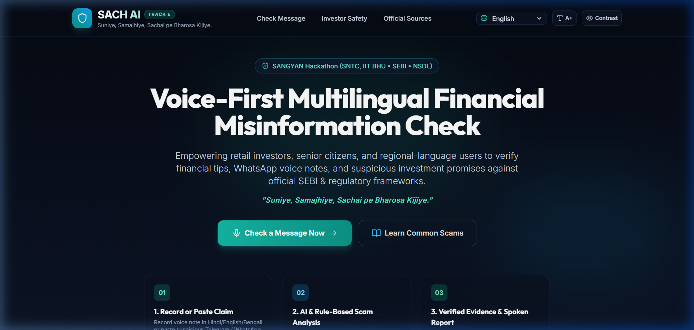
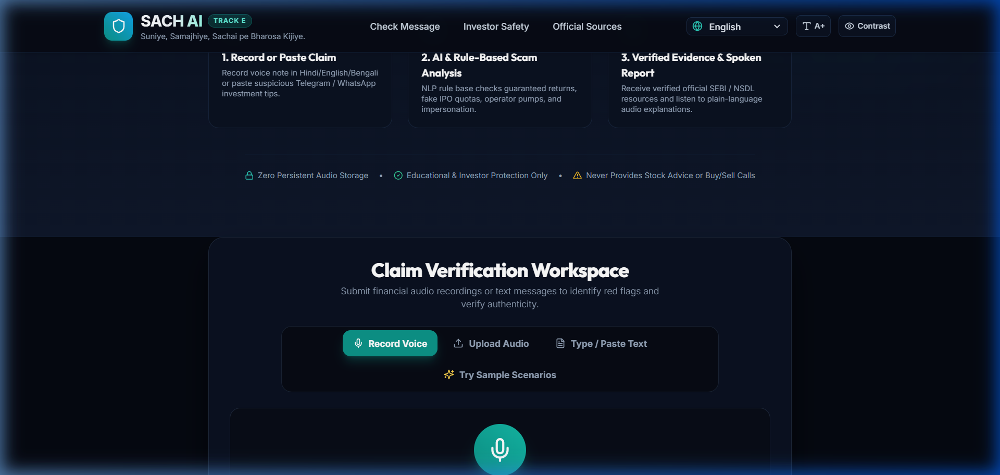
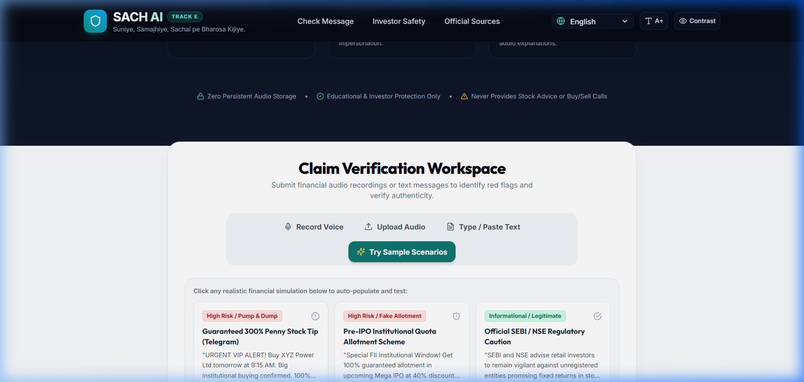
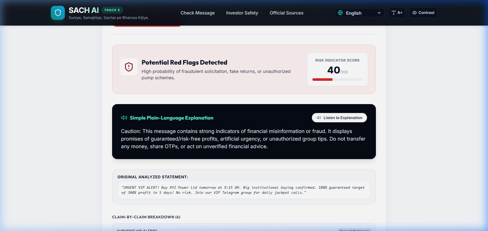

# SACH AI — Smart Assistant for Checking Honesty in Financial Information

> *"Suniye, Samajhiye, Sachai pe Bharosa Kijiye."*  
> *(Listen, Understand, Trust only the Truth.)*

[](LICENSE)
[](https://github.com/sustik78/Narayana-National-Hackathon-2026)
[-emerald)](#)

---

## 📌 Project Identity & Overview

- **Project Name**: SACH AI
- **Full Title**: Smart Assistant for Checking Honesty in Financial Information
- **Tagline**: *"Suniye, Samajhiye, Sachai pe Bharosa Kijiye."*
- **Hackathon**: SANGYAN Hackathon, organized by SNTC, IIT (BHU) Varanasi, in collaboration with SEBI and NSDL.
- **Track**: Track E — Misinformation & Content Literacy
- **Target Audience**:
  - First-time retail investors & Demat account holders
  - Senior citizens and elderly investors vulnerable to urgent digital threats
  - Regional language users (English, Hindi हिन्दी, Bengali বাংলা)
  - People receiving unsolicited financial advice via WhatsApp voice notes, Telegram groups, and social media reels

---

## 🎯 The Problem & Our Solution

### The Challenge
With over 150 million retail Demat accounts in India, millions of citizens receive daily stock tips promising **300% guaranteed returns**, fake **Pre-IPO institutional allocations**, and AI deepfakes impersonating financial leaders. Existing fact-checking tools require complex text searching, lack native Indian language voice support, and do not connect directly to regulatory frameworks.

### The SACH AI Solution
SACH AI is an **accessible, voice-first multilingual misinformation analysis assistant**. Users can record their voice note or paste text to instantly receive:
1. **Rule & NLP-backed Red Flag Detection**: Flags assured returns, fake IPO windows, operator pumps, and credential harvesting.
2. **Plain-Language Spoken Explanation**: Audio voice readout explaining why a message is risky in English, Hindi, or Bengali.
3. **Official Regulatory Evidence**: Direct, actionable verification links to **SEBI SCORES**, **SEBI Saa₹thi**, **NSDL Depository**, and the **1930 Cybercrime Helpline**.
4. **Investor Protection Hub**: Interactive quiz and 4-step emergency fund recovery guide.

> **Strict Investor Protection Mandate**: SACH AI is strictly for financial literacy. It **never** provides stock recommendations, buy/sell calls, price targets, or portfolio advice.

---

## 📸 Screenshots

| 1. Landing Page & Hero | 2. Claim Verification Workspace |
|:---:|:---:|
|  |  |

| 3. Sample Scenarios & Testing | 4. Analysis Results Dashboard |
|:---:|:---:|
|  |  |

---

## 🏗️ Architecture & Technology Stack

```
+-----------------------------------------------------------------------------------+
|                                  USER CLIENT                                      |
|  (Microphone Voice Notes / Upload Audio / Pasted WhatsApp Tips / Multilingual UI) |
+------------------------------------------+----------------------------------------+
                                           |
                                           v
+-----------------------------------------------------------------------------------+
|                        REACT + VITE + TAILWIND CSS FRONTEND                       |
|   - MediaRecorder Audio Capture & Audio Preview                                   |
|   - Multilingual Context Provider (English, Hindi हिन्दी, Bengali বাংলা)          |
|   - Accessibility Engine (Large Text A+, High-Contrast Mode)                      |
|   - Audio Playback Controls for Spoken Results                                    |
|   - Interactive Scam Awareness Quiz & 1930 Emergency Reporting Workflow           |
+------------------------------------------+----------------------------------------+
                                           |  REST API (JSON / Multipart Audio)
                                           v
+-----------------------------------------------------------------------------------+
|                            FASTAPI BACKEND SERVICES                               |
|   +-------------------+  +--------------------+  +----------------------------+   |
|   | /api/transcribe   |  | /api/analyze       |  | /api/speech                |   |
|   | Speech-to-Text    |  | NLP Pattern Engine |  | gTTS Text-to-Speech Base64 |   |
|   | & File Validation |  | & LLM Synthesizer  |  | Audio Synthesis            |   |
|   +-------------------+  +--------------------+  +----------------------------+   |
|   +-------------------+  +--------------------+  +----------------------------+   |
|   | /api/education    |  | /api/sources       |  | SQLite Audit Logger        |   |
|   | Modules & Quiz    |  | SEBI/NSDL Registry |  | (Aggregated, Zero PII)     |   |
|   +-------------------+  +--------------------+  +----------------------------+   |
+-----------------------------------------------------------------------------------+
```

### Frontend Stack
- **Framework**: React.js 18 with Vite
- **Styling**: Tailwind CSS (Dark OLED Theme)
- **Icons**: Lucide Icons
- **Accessibility**: High-contrast mode, Large text mode (A+), full keyboard accessibility

### Backend Stack
- **Server**: Python 3.12, FastAPI, Uvicorn, Pydantic data validation schemas
- **AI & NLP**: Multilingual rule matching, Claim sentence extraction, optional OpenAI/Gemini integration
- **Speech**: `SpeechRecognition` multi-language transcription, `gTTS` audio synthesis with browser fallback
- **Storage**: SQLite local database for aggregated, non-sensitive telemetry

---

## 🚀 Quick Start & Installation

### Prerequisites
- Python 3.10+
- Node.js 18+ and npm

### 1. Clone & Configure
```bash
git clone https://github.com/sustik78/Narayana-National-Hackathon-2026.git
cd Narayana-National-Hackathon-2026
cp .env.example .env
```

### 2. Run Backend
```bash
cd backend
pip install -r requirements.txt
python -m uvicorn app.main:app --host 127.0.0.1 --port 8000 --reload
```
*Backend API docs available at: `http://127.0.0.1:8000/docs`*

### 3. Run Frontend
```bash
cd ../frontend
npm install
npm run dev
```
*Open `http://localhost:5173` in your browser.*

---

## 🐳 Docker Deployment

```bash
docker-compose up --build
```
- Frontend: `http://localhost:5173`
- Backend API: `http://localhost:8000`

---

## 🧪 Automated Testing

Run the backend test suite:
```bash
python -m pytest backend/tests
```
*Includes unit tests for regex/NLP pattern matching, multi-language detection, end-to-end claim analysis, and API endpoints.*

---

## 🔒 Security & Privacy by Design

- **Zero Persistent Audio Retention**: Audio streams are processed in-memory / temporary buffers and immediately wiped.
- **No PII or Financial Credentials Stored**: SACH AI never asks for or stores OTPs, bank passwords, or PAN numbers.
- **Statutory Disclaimers**: Clear disclosure that SACH AI is an educational tool and does not provide certified financial advice.

---

## 📂 Repository Structure

```
Narayana-National-Hackathon-2026/
├── backend/
│   ├── app/
│   │   ├── main.py
│   │   ├── config.py
│   │   ├── models/schemas.py
│   │   ├── services/
│   │   └── data/
│   ├── tests/
│   ├── requirements.txt
│   └── Dockerfile
├── frontend/
│   ├── src/
│   │   ├── components/
│   │   ├── context/
│   │   ├── locales/
│   │   └── services/
│   ├── package.json
│   └── Dockerfile
├── docs/
│   ├── architecture.md
│   ├── api_spec.md
│   ├── user_guide.md
│   └── threat_model_and_safety.md
├── demo/
│   ├── script.md
│   ├── sample_audio_transcripts.md
│   └── recording_checklist.md
├── presentation/
│   ├── SACH_AI_Pitch_Deck.pptx
│   ├── SACH_AI_Pitch_Deck.pdf
│   ├── generate_deck.py
│   └── presentation_slides_content.md
├── screenshots/
├── docker-compose.yml
├── .env.example
├── .gitignore
├── LICENSE
└── README.md
```

---

## 🏆 Hackathon Submission Details

- **Event**: SANGYAN Hackathon (IIT BHU Varanasi • SEBI • NSDL)
- **Track**: Track E — Misinformation & Content Literacy
- **Pitch Deck**: Available inside [`presentation/`](presentation/) (.pptx and .pdf)
- **Demo Script**: Available inside [`demo/`](demo/)
